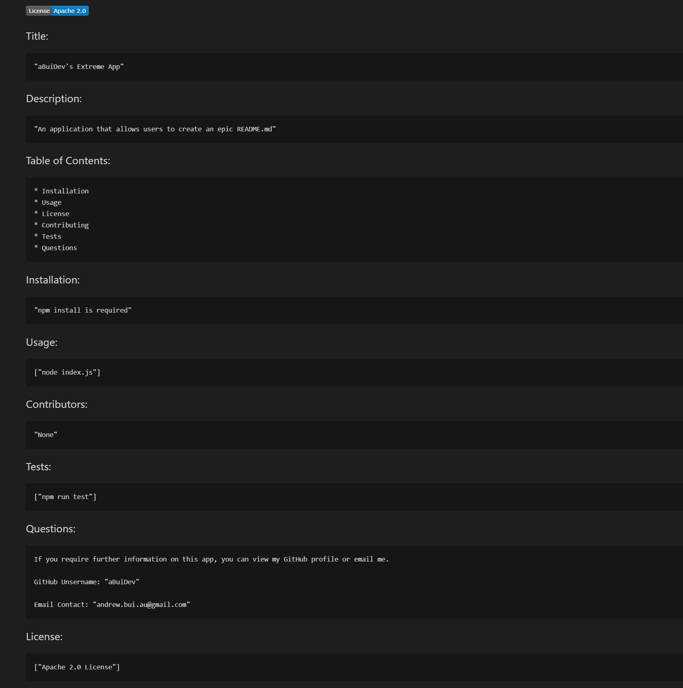

Markdown Generator 01:

Created a Markdown (.md) generator using JavaScript, ES6, Node.JS, GitHub and GitBash.

Installation:
To properly operate the app, a user will need GitBash and Node.JS. The user is also required to run a "npm install" to get the necessary npm modules.

Final Notes:
Overall a positive experience; a key challenge that I faced for the information would output in a different order i.e. the badge would appear belove the title instead of at the top.
This was resolved through changing the fs.appendFile modules.

This app was created by Andrew Bui (aBuiDev)

Link to presentation video here:
https://youtu.be/v6yWsZh8V54
